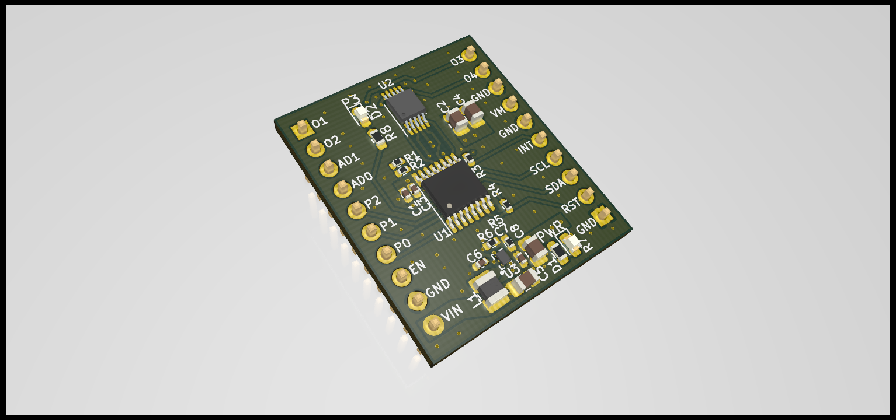

# PCA9629A I²C Stepper Motor Controller Breakout Board 

- ## Features

  - PCA9629A I²C Stepper Controller
  - A3909 Dual Full Bridge Motor Driver
  - MAX17291 5.5V Boost Converter powering the controller and motor driver (can be deselected through jumpers to power a stepper motor up to 18V)
  

